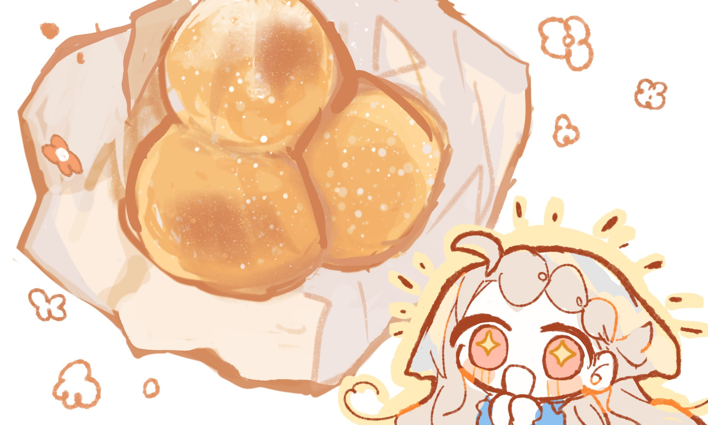

<!DOCTYPE html>
<html lang="ja">
<head>
    <meta charset="UTF-8">
    <meta name="viewport" content="width=device-width, initial-scale=1.0">
    <title>住みよい部屋</title>
    
</head>
<body>
    <h1>アーカムの魔女</h1>
    

        
<strong>日時:</strong> 2025年3月8日

        
<strong>参加者:</strong> おしおみどり, ねじ, モグラ

        
<strong>あらすじ:</strong> 街に広がる霧の正体とは……？

        <h2>住みよい部屋</h2>
 　　　 

 　　　 

 　　　 
 　　　 
        

 　　　 

 　　　 
【裕福な子供】 
 　　　 

 　　　 

 　　　 

 　　　 
 風が産毛を撫で、微睡の中にあった意識を徐々に浮き上がらせていった。
 　　　 
ゆっくりと体を持ち上げ、二階の窓から外を眺める。
 　　　 
 石で造られた壁のざらりとした感触がまだ眠っていた意識を現実へと連れ出し、風が運んでくる湖の香りで五感はゆっくりと覚醒する。

 　　　 
 
        

 　　　 

 　　　 
 　　　 
        

 　　　 

 　　　 
 　　　 

 　　　 
1691年8月のセイラム。
 　　　 
夏はまだ始まったばかりで、窓から外を覗くとあなたの　　　 　　　 
        
                                  ──レンの庭が目に入る。
        

 　　　 

 　　　 
 　　　 
        

 　　　 

 　　　 
畑では朝早くから奴隷がトウモロコシ畑を弄り、水を撒いている。
 　　　 
 朝日が葉を反射させ、きらきらと輝かせた。
 　　　 
　（セイラムの夏は高くても気温は25度までしか上がらず、過ごしやすかっただろう）
 　　　 
 
 　　　 

 　　　 
その様子を見ていると、腹の虫が空腹を知らせる。
 　　　 
 食事を取るため寝間着から衣服に着替えて、階下のリビングへと降っていく。
 　　　 
途中で掃除をしていた使用人たちが手を止め、頭を下げるがあなたにとっては慣れ親しんだ光景だ。挨拶を返しリビングの扉を開けた。
 　　　 

 　　　 

　　　　　

 　　　 

 　　　 
  既にあなたの父と母は席に着き、あなたの到着を待っていた。
 　　　 
急いで席に着けば、まだ出来たばかりのスープと塩漬けにされた魚と野菜に出来たばかりのスクランブルエッグが並んだ。
 　　　 
神に感謝の言葉を告げ、食事に手をつける。 　　　 
        
魚と野菜の塩見はコーンスープの薄味で相殺されるだろう。
 　　　 
 
 　　　 
 母 : 「今日は何か予定があるのですか？」
 　　　 
今日の予定はいつも通り、幼馴染たちと森に行くつもりだ。先日うさぎを見つけ、捕まえるための罠を作ろうと意気込んだのだ。
        
  

 
 
 
 　　　 
　
 　　　 
 
 
 
 
 
 
レン：「おはよう、ママ！」
 　　　 
 レン : 「今日はね、皆でウサギを捕まえるのよ！」
 　　　 
　
 

 　　　 
母 : 「怪我はしないように気を付けるんですよ」
 　　　 
父 : 「遊ぶのも良いが、午後の勉学に遅れないようにしなさい」
 　　　 
レン : 「もちろん、わかってるのよ、ちゃんと捕まえたらすぐ帰ってくるわ！」
 　　　 
 母 : 「身分の低いモノと同じ目線に立つのは今後のために必要です。しっかり学ぶのよ」 
 　　　 

 　　　 

 　　　 

　　　 

 　　　 

 　　　 
 

食事を終え、兎を捕まえるのに使えそうな罠づくりの道具を選んでバッグに詰め込む。
 　　　 
 髪を整え帽子を被り、玄関から外に出ようとすると声を掛けられた。
 　　　 

 　　　 
ジャン : 「お嬢さん、今日もお友達とお出かけですか？」
 　　　 
振り返ると肌の黒さが特徴的な男に呼び止められる。 　
　　 
 にこにこと白い歯を見せて笑ってくるこの男はジャンと言い、あなたが生れる前からここにいる奴隷の一人だ。

妻が厨房で料理を作っているからか、たまに「御裾分け」をしてくれることがあり、子供の心としては彼を見るとつい胸が高鳴ってしまう。　
 　　　 
 
 　　　 

 　　　 

 　　　 
レン: 「！」
 　　　 
レン: 「その声は、ジャン！」

レン : 「おはよう、今日もおでかけなの～！」
 　　　 
 
 　　　 
ジャン : 「じゃあお嬢さんのためにこれを渡しましょう。ご主人には秘密ですから、お友達と分け与え合うんですよ」
 　　　 
そう言って渡された紙の中には、小さな揚げたパンが何個か入っている。
 　　　 
ジャン : 「叱られないようお昼までに帰って来てくださいね」
 　　　 
 

 　　　 
 　
 　　　 

 　　　 
 目を輝かせ受け取り頬を綻ばせる
 　　　 
レン: 「えへへ、もちろん！2人も喜ぶわ、大切に食べるわね」
 　　　 

 

 　　　 
 
 　　　 

 　　　 

 　　　 

 　　　 
 

今日の天気は快晴で、木陰で落ち合うと心地よい夏の風が通り抜けるだろう。
 　　　 
  あなた達は午前の仕事手際よく終わらせたり、サボったりして今日の集合場所───森の入り口に集まった。
 　　　 
アメリアは、兎取りという事で家にいる犬を連れて来た。主人の命令を今か今かと、尻尾を左右に揺らしながら表情を伺っている。
 　　　 

 　　　 
いぬ : 「ワン！」
 　　　 
アメリア : 「よしよし…　よかった、つれてってもいいってお母さんが許してくれて…」
 　　　 
レイチェル : 仁王立ちで待っている
 　　　 

 　　　 

　　　　　
 　
 　　　 
てってこてってこ
 　　　 
 レン　: 「2人ともーーーーー！おはよーーーーー！！！」

 　　　 
 
 　　　 

 　　　 

 　　　 
アメリア : 「あ！レン…！おはよう…！」
 　　　 
レイチェル : 「遅いわよっ！アタシが一番じゃない！」
 　　　 
マックス : 「ﾜﾌ」
 　　　 
アメリア : 「ご、ごめん…　マックスが途中で止まっちゃって…」
 　　　 
マックス : 「？」
 　　　 
 

 　　　 
 レン : 「えへへ、まあいいじゃない～」
 　　　 
レイチェル : 「まぁいいけどっ。今日はウサギを捕まえて夕飯にするんだから、ちゃんとしてよね〜」
 　　　 
 アメリア : 「だ、だいじょうぶだよ　罠も作るし、マックスもいるし…」
 　　　 
マックス : 「ワン！」尻尾ﾌﾞﾝﾌﾞﾝ
 　　　 
 
 　　　 
レン : 「がんばるのよマックス、レイチェルの晩御飯がかかってるわ」撫で
 　　　 
マックス : 「ﾍｯﾍｯﾍｯﾍ」
 　　　 
レイチェル : 「相変わらずのアホヅラ犬ね…………」
 　　　 
 マックス : ｶﾞﾙﾙﾙ……………

レイチェル : 😮
 　　　 
 マックス : どうした小娘
 　　　 
 レイチェル: 😡👊
 　　　 

 　　　 
アメリア : 「か、顔はともかく、ちゃんと賢いよ……」
 　　　 
アメリア : 「いうことも、ちゃんと聞いてくれるし…」
 　　　 

 　　　 

 　　　 

 　　　 
 アビゲイル : 「あら、何かうるさいと思えばまたおまえたち？」

 　　　 
 
 　　　 

 　　　 

 　　　 
 少し遠くから、上ずった甲高い猫が鳴いているような声がした。
 　　　 
 振り返ると、成長したトウモロコシのような小金のくせっ毛を、腰のあたりまで伸ばした少女、
 　　　 
年前にこの村に越して来た牧師の子供であるアビゲイルたちがあなた達を睨みつけるように見ていた。
 　　　 

 　　　 
その後ろには頭から灰を被ったような、くすんだ灰褐色の髪をしたアビゲイルの家族、
 　　　 
 ベティが申し訳なさそうにこちらを見ている。

 　　　 
 あなた達3人の姿を見て、鼻で笑うと頼まれていないのに口を開く。
 　　　 

 　　　 
アビゲイル : 「神から与えられた仕事もせず、森に行くなんて蛮行、神が知ったら地獄落ちよ」
 　　　 
アビゲイル : 「泥臭いのが移るわ、下民と関わっていると品位も下がっていくのね。勉強になったわ」
 　　　 
 ベティ : 「アビィ、そ、それ、それは言い過ぎ……」
 　　　 
アビゲイル : 「おまえは話さない方がいいわ、どんくさいんだから黙ってなさい」
 　　　 

 　　　 
ベティがおずおずと口を挟むが、アビゲイルはぴしゃりと冷たく言い放つ。その言葉で、ベティはきゅっと唇を固く結んで俯いた
 　　　 
 
　　　　

 　　　 
 
 　　　 
 アメリア : 「く、臭かったかな　ちゃんと洗ったはずなんだけど…」服くんくんする
 　　　 
レイチェル: 「そんなにアタシたちと遊びたいの〜？隠しきれてないんですけど！そういう生意気なこと言うと遊んであげな〜い。ぴっぴろぴー」
 　　　 

 　　　 
 レン : 「わー、うるさいアビーが出てきたよ～」嫌そう
 　　　 

 　　　 
アビゲイル : 「牧師の娘に対してそんな口を利いて良いの？」
 　　　 

 　　　 
  アビゲイルは不機嫌そうに答えると、再びあなた達に冷たい視線を向けた。

 　　　 
アビゲイル : 「不本意だけど教えてあげる、次の9月から教会で子供に文字を教えるわ」
 　　　 
アビゲイル : 「畑仕事も終わるし、おまえたちも聖書くらい読めるようになりなさい」
 　　　 
アビゲイル : 「主は慈悲深いから、くだらない事をしている下民にも機会を与えてくださるそうよ」
 　　　 

 　　　 
 （当時アメリカでは神の教えを広める＝聖書を読めるようにするために教会側主導で子供に文字を教えており、書けるかはともかく識字率は意外と高かった）
 　　　 

 　　　 
レン : 「はえ～そうなのね～」どうでもよさそうに相槌を打っている
 　　　 
レイチェル : 「ふーん、アンタは文字の前にお友達に対する態度ってもんをお勉強した方がいいと思うけどね。主は見てるわよ、アンタのその傲慢な態度！」
 　　　 
 アメリア : （ちょっと行ってみたい気もするけど…怖そうだなぁ…）

レイチェル : 「ま、行ってあげてもいいけど〜」
 　　　 
 レン : 「いいんだ…」
 　　　 

 　　　 

 　　　 
 アビゲイル : 「おまえたちと違って、私は敬虔だから」
        
「神に仕える牧師の娘であるこちらを馬鹿にする方が、問題じゃないかしら？」
 　　　 

 　　　 
 　　　 
        
 アビゲイル : 「私は心が広いから、おまえの態度にも目を瞑ってあげましょう」
 　　　 
 アビゲイル : 「これ以上ここに居たら泥臭いのが移るわ。帰るわよ」
 　　　 
 
        
 背を向けて村の方に帰っていく。一緒にいたベティどうしようかと慌てふためいてこちらにお辞儀をし、焦る様にアビゲイルの後を追いかけていった。
 　　　 

 　　　 
 　　　 
        
レイチェル : 「あれわざわざ言いにきたんだー、牧師の娘って暇なの？アタシは兎とりで大忙しなワケだけど」
 　　　 
 アメリア: 「ちょっと、やなかんじだよね…」
 　　　 
 レン : 「めんどくさいの～、喧嘩は嫌なのよ～」
        

 　　　 
入れ替わるようにして、アビゲイル達が去っていった方向とは別の所から待ち人──エイダが息を切らしながらやってくる。
 　　　 
 　　　 
        
 エイダ : 「遅れてわりい！って……なんかあったか？」
 　　　 
アビゲイルのせいで生み出された微妙な空気を察したのか、開口早々質問してくる。
 　　　 
 
        
【　目星　】    成功・アメリア・レイチェル
 　　　 
   成功：エイダの手先は荒れており、いつものことだが彼の仕事は大変そうだ。
 　　　 
 　　　 
        
アメリア: 「な、なんでもないよ　アビゲイルがきただけ」
 　　　 
レイチェル: 「アビー、アタシのこと大好きなのよね〜。すぐつっかかってくるの」自己肯定感1000
 　　　 
エイダ : 「そ、そうか～」レイチェルに苦笑い
        

 　　　 
 レン : 「おはようエイダ、今日もいつも通りいい日よ！」
 　　　 
 アメリア : 「おはよ、エイダ、おしごと大変そうだね　おつかれさま…」　　　 
        

 　　　 
エイダ : 「あそこのお嬢さんはおっかないからな」肩をすくめる
 　　　 
エイダ : 「ああ、ちゃんと午前中の分は終わらせてきたから遊べるぜ」
        
エイダ : 「気分も切り替えて、兎を捕まえに行こう」
 　　　 

 　　　 
 　　　 
        

 　　　 
 マックスもそれに同意する様に「バウ！」と元気よく吠える。日曜でないのに遊んでいる所を見られたら、他の人に何か噂されるかもしれない。
 　　　 
 
        
 4人とも同じことを考えたのか、顔を見合わせ草木が生い茂る森の中へと進んで行った。
 　　　 

 　　　 
 　　　 
        

 　　　 
暫く歩くと、丁度いい切り株が見つかる。あなた達はそれをテーブルにするように囲い、各々持ってきた道具を取り出す。
 　　　 
 並べられた道具を見て、エイダは満足そうだ。
        

 　　　 
エイダ : 「この辺りなら咎められないだろうし、そろそろ罠づくりをするか」
 　　　 
 　　　 
        

 　　　 

 　　　 
 
        
～rabbit stick～
 　　　 
ラビットスティックを作ろう！
 　　　 
 ラビットスティックはブーメランのようなもので、投げて兎に当て気絶させるぞ！　　　 
        
上手く作るのには以下の手順だ！
 　　　 

 　　　 
 
        
① 　良い感じの木の棒を持って来れてたか【　幸運　】
 　　　 
② 　木を良い感じに削れるか【　DEX　/　STR　】
 　　　 
③ 　集中力が続くか【　INT　/　POW　】
　　　 
        

 　　　 
技能一つ成功するごとに1d50で判定し、出来栄えを決める。
 　　　 
 50以上で満足！50以下で微妙な出来栄えとなる
        

 　　　 

 　　　 
 　　　 
        
【結果】　　アメリア　37点　レイチェル 22点　レン　51点
 　　　 

 　　　 
 
        
アメリア: 丁寧に、着実に作業を進め、なぜか微妙なものが出来上がった
 　　　 
レン: 「あーん、飽きちゃったー」
 　　　 
レイチェル : ゴロゴロした後途中で異様な集中力で作業を始めたが、あまりにも棒が微妙だった 　　　 
        

 　　　 
アメリア : 「で、できた…」
 　　　 
アメリア : なんか微妙…………
        
エイダ : 「お、おう……………」言葉に困る
 　　　 
レイチェル : 「棒さえちゃんとしてればいけたはずよっ」😡
 　　　 
アメリア : 「素材はちゃんと選んだはずなんだけどな…………」　　　 
　　　　
 　　　 
        

 　　　 

 　　　 
 各々、ブーメランのようにしなった棒を持ち、肝心の獲物を見つけるため奥へと進んで行く。
        
森の中は静かで、何かがはっぱを揺らす音がする度兎の足音かと思い振り向くが、どれも風によって揺れた葉の騒めきばかりだ。
 　　　 

 　　　 
 　　　 
        
兎を見つけよう！
 　　　 
兎を見つけるためには【　聞き耳　】と【　追跡　】の両方を成功させる必要がある。
 　　　 
 
        
　結果・　みんな失敗
 　　　 

 　　　 
 　　　 
        
犬を連れている探索者は失敗した場合、犬の【　においで追跡　】90％で判定を行う事が出来る。
 　　　 
アメリア : 「マックス…、おねがい」
 　　　 
マックス : 「わん！」
        

 　　　 
 マックスはふんふんと鼻を鳴らし歩き回るが、肝心の兎は見当たらない。
 　　　 
 その時、マックスが立ち止まり、一点を見つめた。
        
そこには茶色く地面と同じ色になった兎が辺りをきょろきょろと見回し、外敵がいないか警戒していた。　　　 

 　　　 

 　　　 
 兎を捕まえるには【　投擲　】
        

 　　　 
兎は正確に飛んできた凶器に反応する事ができず、ガンと固い物がぶつかり合う音が響いた。
 　　　 
 投擲に成功した探索者は即時【　1d10　】成長 　　　 
        
アメリア : 「や、やった…！」
 　　　 
アメリア : 1D10 (1D10) ＞ 6
 　　　 
  エイダ : 「血抜きしないとな、川が近くにある筈だし行ってみようぜ」
        

 　　　 

 　　　 
 　　　 
        
 森の中は日陰になっているおかげか、熱さを感じず過ごしやすい。
 　　　 
 エイダは先行する様に森の中を見回しながら獣道を探し、あなた達もそれに倣う。
 　　　 
 
        

 　　　 
 【　聞き耳　/　目星　】
 　　　 
 　　　 
        
 　　 成功：足を進めていくと、水場が近いからか段々と土が柔らかくなっていく。　 
        
                                                       アメリア ・　レイチェル
 　　　 
                          
 　　　 
 
        
エイダ : 「足元気を付けろよ」
 　　　 

 　　　 
 　　　 
        

 　　　 

 　　　 
 周囲に気を付けていたが川が目に入ったことで気が抜けてしまったのか、レンはぬかるみに脚を取られ、ずるりと滑る。
        
咄嗟に手を出すが、短い手足でなんとか受け身を取ろうとしても間に合わず、そのままぐちゃと音を立て泥にのめり込んだ。
 　　　 

 　　　 
 　　　 
        

 　　　 
レン : 「あーーーーーーっ゛！！！！」
 　　　 
アメリア : 「レ、レン…！」
        
アメリア : あわわ…！
 　　　 
レン : 「やーーーーーっ゛゛！！！！だれかたすけてーーーっ！」
 　　　 
レイチェル: 「ちょっと、気をつけなさいよ〜」　　　 
        
エイダ : 「お、おい！大丈夫か？」
 　　　 
アメリア : 「お、おちついて…ほ、ほら…」手を貸すね
 　　　 
 
        
先頭を歩いていたエイダは二人よりも気付くのが遅くなり、慌ててこちらに駆けよりレンの服に着いた泥を掃う。
 　　　 
エイダ : 「こりゃあ盛大にいったな……」
 　　　 
 　　　 
        
レンは【　アイデア　】
 　　　 
　　　　 (1D100<=60) ボーナス・ペナルティダイス[0] ＞ 8 ＞ 8 ＞ イクストリーム成功
 　　　 
 
        
成功：両親にバレたら、何と怒られてしまうだろう。特にあなたの父親は優しいが、母は外で活発に遊ぶことに眉を顰めている。なんと言われるか今からでも恐ろしい…！
 　　　 

 　　　 
レン : 「あ～～～ん……あ～ん……！」　　　 
        
レン : 「怒られちゃう！怒られちゃう！」
 　　　 
                            べそべそ泣きべそをかいている。愚か。
 　　　 
 
        

 　　　 
アメリア : 「ど、どうしよ…お洋服貸せたらいいんだけど……」
 　　　 
 　エイダは悩んだように眉をしかめる。　　 
        
エイダ : 「泥はそのままにしておけ。水で洗うと落ちないから、上着は脱いで顔を洗っておけよ」
 　　　 
レイチェル : 「怪我してないならいいじゃない」
 　　　 
レイチェル : 「怒られるくらい別にどーってことないわ」 
        
アメリア : 「えっ、水で洗ったらダメだったんだ…」洗っちゃってた……
 　　　 
レン : 「でも怒られるのやなの～……」言われた通りに上着を脱ぎ顔を洗う
 　　　 
 　　　 
        
        両手を上げると「バンザーイ」と言いながら上衣を脱がされ背中を叩かれる。
 　　　 

 　　　 
 
        
エイダ : 「顔の泥流してる間に服の方は見といてやるから」
 　　　 

 　　　 
 　　　 
        

 　　　 
ひと汗かいたのを流すため、川に足を踏み込むと冷えた水がきんと背筋を走った。
 　　　 
 
        

 　　　 
夏とは思えない冷たさで、まるでここだけ冬になってるみたいだ。
 　　　 
その下流ではエイダが兎を川の中に沈め、汚れを落としている。 　　　 
        

 　　　 

 　　　 
 
        
～うさぎの血抜き～
 　　　 
時間が経たないうちに、下処理を済ませよう。
 　　　 
 　　　 
        
① 　うさぎを綺麗に洗うのに【　APP　】
 　　　 
② 　血抜きするため腹を裂くのに【　DEX　/　STR　】
 　　　 
③ 　集中力を切らさず作業を続けられるか【　POW　】
 
        

 　　　 
全て上手くできたら【　正気度+1d3　】回復
 　　　 
 　　　　　　　　　　　　　 成功　アメリア
        

 　　　 

 　　　 
 レン : 何やってもうまくいかない…　　　
        
アメリア : 「で、できた　よ…」　　 
        
アメリア : 1d3 (1D3) ＞ 3    SAN : 65 → 68
 　　　 

 　　　 
 アメリア : 自己肯定感上がってきた
        

 　　　 
エイダ : 「おーい、レン。服の中になんか入ってたぞ」
 　　　 
 　　　 そう言ってエイダはレンに朝貰った揚げパンが包まれた紙を渡す。
        

 　　　 
エイダ : 「それ何が入ってるんだ？」
 　　　 
レイチェル: 嗅ぎに行く　匂いを
        
レン : 「あ～！」
 　　　 
レン : 紙を受け取りぱかりと開く
 　　　 
レン : 「これはね、うちのがくれたおやつ…」 　　　 
        
レン : 「みんなで食べたかったのだけど……」まだ食べれるかな？
 　　　 

 　　　 
 アメリア : 「わ、いいにおい………」
        
 レイチェル : 「ちょっとくらい汚れててもいいじゃない」
 　　　 
 レン : 「泥は口に入らないようにね～」
 　　　 
 　　　 
        

 　　　 
子供のお腹を満たす為か、油で念入りに揚げられたパンは数は少ないものの、
 　　　 
 空腹を無くすのには十分な量だった。

        
自然を感じながら油を吸い込みパリパリに揚げられたパンを友達と食べるのは、
 　　　 
これまた特別な味がする。

 　　　 
 　　　 
        
エイダ : 「美味しいな、これ～」もぐもぐ
 　　　 
レイチェル : 「ふんふんふん」食べてる
 　　　 
アメリア : 「お、おいしい～～～……」ほっぺおさえてもぐもぐする……
        
レン : 「えへへ……そうよね～♪」機嫌がなおった
 　　　 
マックス : 「ワン！」
 　　　 
 
　　　  
　　　 
        
4人で話し合っている時、一緒に遊んでいたマックスが大きく吠え体を震わせ水しぶきを飛ばす。
 　　　 
【　DEX　】
 　　　 
 
        

 　　　 
           成功：水滴を華麗に避ける  失敗：うわあ！びしょぬれだ

 　　　 
 　　　                  成功　アメリア
        

 　　　 

 　　　 
アメリア : 「う、わぁ！　だ、だめだよ　マックス……」
        
マックス : ﾌﾞﾌﾞﾌﾞﾌﾞﾌﾞ
 　　　 
アメリア : 慣れてるのかきゃっと避ける
 　　　 
レン : 「あ゛゛～～～っ！！！」水濡れ　　　 
        
レイチェル : 「駄犬！」
 　　　 

 　　　 
 
        

        

 　　　 

 　　　 
 　　　 
        

 　　　
 　　　 
犬は一点を見つめ、低い声で唸る。
 　　　 
釣られるように、あなた達は犬と同じ方向に視線を向けた。 　　　 
        

 　　　 

 　　　 
 目に入ったのは、異常に大きな、そして光を吸い込むような漆黒の瞳。
        
 その瞳が、まっすぐこちらを見つめていた。視線が合った瞬間、全身の血が凍りつく。
 　　　 
 それはまるで海から這い出てきたかのように、 　　　 
        
 　全身がぬらりと光る鱗で覆われ、湿った腐臭がまとわりついていた。
　　 
        

 　　　 
────人間の顔と、魚の顔が不気味に混ざり合った異形。
 　　　 
 目は大きく、瞼がなく、常に薄暗い光を放っている。口元は広く裂けており、鋭い歯が密集している。
        
 吐息がかすかに漏れるたびに、そこから潮と腐敗した何かの臭いが漂った。

 　　　 

 　　　 
 　　　 
        
恐ろしい魚人を見た探索者は≪正気度喪失0/1d6≫
 　　　 

 　　　 
 
        
 [ レン・ホーソーン ] SAN : 50 → 48
 　　　 

 　　　 
 　　　 
        
エイダ : 「お、おい！逃げるぞ！！」
 　　　 
アメリア : 「えっ、な、なに……？」さかな…………？？
 　　　 
レイチェル : 「は…？」？ 　　　 　　　 
        
レン : 「あ、あれ～～…？な、なんかいる…の？」
 　　　 

 　　　 
 
        
レンの手を引き、エイダは森の中へと走り出す。
 　　　 
その声でハッとして、置いてかれないよう地面を蹴り上げ足を動かした。
 　　　 
後ろを振り返らず、がむしゃらに、友人たちを見失わないように恐怖に足を駆り立てられながらも必死で前に進み続けた。　　　 
        

 　　　 

 　　　 
 
        
【　CON/H　】
 　　　 

 　　　 
 アメリア : 「あっ、まってまって……っ」　　　 
        

 　　　 

 　　　 
　エイダ＞失敗
        
　レイチェル＞失敗
 　　　 
　レン＞失敗
 　　　 
  アメリア＞失敗　　 
        

 　　　 

 　　　 
 次第にあなた達の足は遅くなり始める。
        
 止まったら追いつかれる、まだ走り続けろ。
 　　　 
 そう言おうと後ろを振り向いたが、川からは随分と離れ、魚人の影も形もなくなっていた。
 　　　 
 夢だったのかと思うが、夢だったと片づけるには脳に焼き付いた光景が離れそうにもなかった。　　　 
        

 　　　 
マックス : 「わふ……………」
 　　　 
レン : 「……なん、なんだったの……？」
        
アメリア : 「はぁっ、はぁっ……」
 　　　 
レイチェル : 「ちょっとちょっと、あんなのいるなんて聞いてないんだけどっ森ってすごいっ！」
 　　　 
アメリア : 「あんなのいるって、お母さんに聞いたこと無いよ…」　　　 
        

 　　　 
【　知識　/　アイデア　】
 　　　 
 
        
アメリア＞失敗・成功
 　　　 
レイチェル＞成功・イクストリーム成功
 　　　 
レン＞失敗・失敗
        

 　　　 

 　　　 
成功：そういえばこの森って、残虐な原住民がいると両親にきつく言われている。
        
　　　　ずっとここに居たら、殺されて焼かれ食われちゃんじゃないか！？危ないんじゃないか！？
　　　　　　　　　　
 　　　 
　　　　と両親から聞かされた寝物語を思い出し≪正気度喪失0/1≫ 　
 　　　 
 　　　 
        

 　　　 
冷静になって辺りを見回すと、周囲に見覚えは全くない。
 　　　 
共について来た犬も怯えたように尻尾を仕舞いこみ、耳を下げて探索者の足元にくっついている。
        
エイダもしまった！という言葉が顔に浮かび上がるくらい青ざめている。
 　　　 

 　　　 
 　　　 
        
アメリア : 「そ、そういえば、原住民がいるって…　もしかして、あれが…？」
 　　　 
レン : 「え？え？」
 　　　 
アメリア : 「ど、どうしよう…！！焼かれて、食べられちゃうって…！」 
        
レイチェル : 「ますますワクワクしてきたわね！」
 　　　 
エイダ : 「ま、待ってても危ないし、森から出よう！何とかなるだろうし！」
 　　　 
レイチェル : 「でも今の場所も分からないわ」 　　　 
        
アメリア: 「マ、マックス…　わかる…？？」
 　　　 
マックス : 「ｸｩ~ﾝ」
 　　　 
 わかんなそう
        

 　　　 

 　　　 
 　　　 
        
周囲は葉の隙間から零れ落ちる程度の光源しかなく、昼にも関わらず夜のように暗い。
 　　　 
時折足元を鼠が駆け抜け、木の上からは猫と鳥が肩を並べ合いこちらを見つめる。
 　　　 
 まるで絵本の中に入ってしまったようで、絵本ならばこの先にいるのは間違いなく悪いやつだ。 
        

 　　　 
そんな不安を抱えながら足を進めていくと、見覚えのない一軒家が見つかる。
 　　　 
 じめじめとして、陽が射さないこんな森の奥で、二階建てのこじんまりとした木造りのその建物は横に井戸が設置されていた。窓は濁っているせいか中は伺えず、今ここに人がいるか分からない状態だ。　　　 
        

 　　　 
 【　目星　/　アイデア　】
 　　　 
 成功：井戸にかけられている桶は腐っておらず、定期的に使われている形跡がある。
        

 　　　 

 　　　 
レン: 「あ、おうち！誰かいるかしら！」
        
レイチェル : 「人喰い魔女かも！」
 　　　 
レン : 「やだーー！！」
 　　　 
アメリア : 「ひぃ…」　　　 
        
エイダ : 「でも、道くらいは知ってるかもしれないし……………行ってみるか？」
 　　　 

 　　　 
レン: 周りを見る
        
レイチェル: 「アタシは勿論行くわよ」
 　　　 
アメリア : 「み、みんながいっしょなら…」
 　　　 
レン: 「こわいの嫌なの～」パーティーの真ん中でついていく 　　　 
        

 　　　 

 　　　 
 
 

 　　　 

 　　　 
 
        

 　　　 

 　　　 
 　　　 
        

 　　　 

 　　　 
 

        

 　　　 
　扉をノックするが、返事は帰って来ない。
 　　　 
  そのまま扉に手をかけるなら、鍵などないのかするりと中に入る事が出来た。　　　 
        
 家の中に入って最初に感じた事は
 　　　 
鼻腔をくすぐる果物のような甘い香りと、天井から吊り下げられた葉っぱや海藻らしきものが目に入る。
 　　　 
 　　　 
        

 　　　 

 　　　 
 
        
一言で表すなら、魔女の家と言っても間違いない様相だった。
 　　　 

 　　　 
 　　　 
        

 　　　 

 　　　 
 
        
探索箇所
【　リビング　/　キッチン　/　別の部屋　/　階段　】
 　　　 

 　　　 
 　　　 
        
レイチェル : そこらへんで拾った木の棒をブンブンさせながら入っていく。
 　　　 
レイチェル : リビングに行くわよ
 　　　 
アメリア : ひぃ～～～
        
レン : 「おじゃましま～～す！」
 　　　 

 　　　 
 　　　 
        

 　　　 
＞リビング
 　　　 
 テーブルの上には萎びた花や空の瓶などが転がっており、食事をしてから片していないのかパンの食べかすが残った皿がそのまま置かれていた。
        
テーブルの上に並べられた瓶の中身は蝋燭のようで、その中には蝋と一緒に花も固められており、部屋の中に入って来た時の甘い香りの正体はこれだったと気が付く。
 　　　 
その他に目立つものと言えば椅子の上には掛布団が置かれているが、椅子の底には見た事ないようなカーブした板が取り付けられゆらゆらと揺れている。
 　　　 
 　　　 
        
【　アイデア　】
 　　　 
            レイチェル失敗　アメリア・レン成功
 　　　 
 
        
 成功：自分の家にもこんな見た目をした花の入った蝋燭が置かれていた気がする……。
 　　　 

 　　　 
 アメリア : 「あっ、こういうの、うちにもある…」　　　 
        
 レイチェル : 「へ〜」
 　　　 
 レイチェル : キッチンに行く
 　　　 
 レン : 「いいかおりのやつ、良い人かも！」
        

 　　　 

 　　　 
 　　　 
        

 　　　 
 ＞キッチン
 　　　 
  棚の中には鹿、山羊の角が並べられ床に毛皮がひかれている。
        
  かまどの上に置かれた鍋の中にはオートミールと森の中で取れる果物以外にも葉っぱのようなモノが雑多に混ぜられ、混沌としている。
 　　　 
  パン屋でしか見ないような竈が置かれ、家主がいないのに関わらず竈には火が付き熱を放っているせいで近寄れそうにない。
 　　　 
 　　　 
        
  【　目星　/　アイデア　】
 　　　 

 　　　 
 成功：何個か置かれた鍋の中に、無造作に筒の長いマスケット銃が入れられている。
大雑把なのかは分からないが、几帳面な性格ではないだろう。
        

 　　　 
アメリア : 「わ、なんでここに銃…？」
 　　　 
レン : 「なんでここにあるのかしら」 　　　 
        
レン : 「使ったのかな？」
 　　　 
アメリア : 「お鍋にってこと…？」
 　　　 
レイチェル: 「知らな〜い。魔女の考えることなんてわかんないもん」  　　　
        
レイチェル : 「それよりこっち」別の部屋へ 　　　 
        
レン : 「魔女も銃を使うのね～」ついてく
 　　　 

 　　　 
 
        
 ＞別の部屋
 　　　 
すり鉢が置かれていたり、本や草花が置かれている。窓際には植木鉢が並んでいる。机に無造作に置かれているノートの中身は、文字は汚すぎるのか癖が強いのか読めない。
 　　　 
 　　　 
        
書いている言葉が読めるかどうか【　知識　】レン以外の探索者は【　知識/H　】
 　　　 

 　　　 
                                        全員失敗
        

 　　　 

 　　　 
 　　　 
        
＞階段
 　　　 
きいきい軋む階段を昇っていくと、天井を押して開くタイプのドアの前に辿り着いた。
 　　　 
軽く手のひらをついて押し上げると簡単にその蓋は開き、屋根裏部屋への道を作る。 
        
中に入ると暫く使われていないのか埃っぽく、じめじめしている。
 　　　 
高所に取り付けられた窓から申し訳程度に日が差し込み、これが唯一の光源となっていた。
 　　　 
 　　　 
        
ベッドと箪笥。
 　　　 
　それがこの屋根裏にある家具たちだ。
 　　　 
 
        

 　　　 
探索箇所
 　　　 
【　ベッド　/　箪笥　】 　　　 
        

 　　　 

 　　　 
 レイチェル : ベッドを見る
        

 　　　 
＞ベッド
 　　　 
 　　　 暫く使われていないのか、ベッドの上には洋服が投げ捨てられている。
丈は長く、女性物のようだ。
        

 　　　 

 　　　 
 【　アイデア　/　APP　】　　⇒レイチェル成功
        
 成功：よれており、この洋服の持ち主はオシャレと言うものに無頓着だとわかる。
 　　　 

 　　　 
 レイチェル: 「魔女ってオシャレに興味ないのね」　　　 
        
 レイチェル : 箪笥に行くぞ
 　　　 

 　　　 
 
        

 　　　 
＞箪笥
 　　　 
 　箪笥を開くとこれまた埃っぽい香りが鼻をつく。
服を少し触ってみると、よほど使っていないのか少しカビのようなにおいもしてくる。　　 
        
【　アイデア　】 
 　　　 
 成功：女性物の衣服が並んでるには並んでいるが、サイズがまばらである。 
 　　　 
 
        

 　　　 
レン : 「きたな～い」
 　　　 
アメリア: 「いっぱい、種類があるね…？　ひとりじゃなかったのかな…」　　　 
        
エイダ : 「でも人いないなあ」
 　　　 

 　　　 
  階段を降りてリビングに戻る。
        
人の住んでる気配はあるが、肝心の住人はいない。だが窯の火がついていた事からそう遠くには行っていないだろう。　
 　　　 

 　　　 
 　　　 
        

 　　　 
レン : 「帰ってくるの待つ？」
 　　　 
アメリア : 「おそくなったら、お母さんに怒られちゃうよ…」 
        
レイチェル : 「森で食べれる山菜をとってきてもいいのよ」
 　　　 
アメリア : 「あ、あぶないよ…さっきのサカナが近くにいるかも…」
 　　　 
エイダ : 「うーん………ちょっとだけ周囲を見るか？」　 　　　 
        
レン : 「それは困るのよ～…」サカナ
 　　　 
レイチェル : 「私だけで行ってもいいのよ。臆病なキッズ達はそこで待ってなさいよ」
 　　　 
レン : 「ム………」 
        
レン: 「そんなことないの！私たちも行くのよ！」
 　　　 
アメリア : 「そ、それならいっしょにいくよ…！」ここで一人で待つのはこわいよ～～！！
 　　　 
 　　　 
        

 　　　 

 　　　 
  　　　 
　　　　
レイチェルが外に行こうと扉に手をかけた時、突然玄関が開かれた。　　　 
        
驚き跳ねるように後ろに下がると、その人の姿が目に入った。
 　　　 

 　　　 
 
        
 あなた達の一回り以上はありそうなその人は、
 　　　 
　生まれて初めて人を見たかのように目を丸くして首をかしげる。

 　　　 
 髪の色は見た事ないくらい綺麗に夏空の色を写し取って派手なのに　　　 
        
服装はコルセットを締めずシャツに帯紐で縛っただけの、この村では見ない服装だ。
 　　　 

        

 　　　 
 　　
        

        

        

        
そんな誰もが目を惹くような鮮やかな髪を隠さずに高い位置で結わえ、
 　　　 
年上であるのに幼く見得るその表情はアンバランスで妙に印象に残った。

 　　　 
 　　　 
        

 　　　 

 　　　 
 
 　　　 
 　　　 
        

 　　　 
「あなた達、何？」
 　　　 
 
        

 　　　 

 　　　 
 　【　アイデア　/　目星　】　　 
        
         アメリア・レイチェル　成功
 　　　 
成功：見た事のない容姿に釣られてつい目が行ってしまったが、その女性は背負うように棒を持ち、その先には死んだうさぎがつられている。どこからどう見ても、自分たちが捕まえたうさぎだ。
 　　　 
 
        

 　　　 

 　　　 
 アメリア: 「あっ…！わたしのうさぎ…！」　　 
        
女 : 「これ人から貰ったんだけど……あなた達のって証拠でもあるの？」不思議そうに聞き返す。
 　　　 
アメリア : 「えっ…？えっ…？でも、だって…」
 　　　 
アメリア : 自分の作業したあととそっくりな兎をじっとみる 
        
レイチェル : 「貴方が人から貰ったって証拠もないじゃない」
 　　　 
女 : 「つまり、あなた達のものって証拠はないのね」
 　　　 
レン: 「本当だもんー！！」 　　　 
        

 　　　 
レイチェル : 「ま、いいわ。アタシの名前はレイチェルよ！アンタがどこの何だか知らないけど、そのウサギは私たちで頑張って捕まえたんだから」仁王立ちで威嚇
 　　　 
レイチェル : 「どうするつもりよ、そのウサギ！」 
        
女 : 「私が貰ったモノだからもちろん、私が食べるわよ」
 　　　 
レン : 「私はレンなのよー、お邪魔してるのよー！」
 　　　 
レン: 「おねえさんはこのおうちの人？」　　　 
        
 女 : 「そうよ、ここは私の家」兎を開いてる鍋に入れる
 　　　 
 女 : 「きみたちは、セイラムの子だよね」
 　　　 
アメリア : 「し、しってる　の…！？」 
        
女 : 「この近くにある村はセイラムだけだしね」　
 　　　 

 　　　 
 　　　 
        
あなた達が返事をすると、ふうとため息をつく。
 　　　 
 【　聞き耳　】　　⇒アメリア成功・アメリアのみ
 　　　 
 
        
アメリア : 何か聞こえたのか、え！？って顔になる
 　　　 
 女 : 「じゃあもしかしてこれもきみたちのモノ？」
 　　　 
 　　　 
        
そう言うと片手に持っていた革袋から、レンの上着を取り出す。
 　　　 

 　　　 
 
        
女 : 「川でうさぎをひろ……貰った時に落ちてたんだよね」
 　　　 

 　　　 
 　　　 
        
レン : 「あーーーーーーーーーーーー！、私の！！！」
 　　　 
レイチェル: 「今これ"も"、って言ったわね」
 　　　 
レン: 「ありがとうおねえさんーー！」 
        
レイチェル: 「ン？ン？」
 　　　 

 　　　 
 服忘れちゃうなんてやんちゃだね～と、あなた達に服を返してくれるが馬鹿にするようににまにまと口角を上げている。　　　 
        

 　　　 
女 : 「にしても泥だらけだね、これじゃあお母さんたちに怒られちゃうよ～」レイチェル無視　
 　　　 
  　　　 

 　　　 
        
 レイチェル: 鍋に放り込まれたウサギを狙っておく
 　　　 

 　　　 
 レン : 「あ、ええと、そうなの……」「怒られちゃうの、困ってるの……」
        
 レン: 「私達すごく困ってるの、迷子だし、汚れちゃうし……」
 　　　 
キザイア : 「ふふ、じゃあ私と勝負して勝ったら、このキザイア・メイスン様が服を綺麗にする魔法を教えてあげよう！」　
 　　　 
 　　　 
        

 　　　 
アメリア : 「！！」
 　　　 
アメリア : みんなにこそこそと耳打ちします
        
アメリア : 「さ、さっき、あの人が、”ここには来れないようにしてるのに、なんでかなあ”って…」
 　　　 
アメリア : 「もしかしたらほんとに、魔女なのかも……」
 　　　 
レイチェル : 「上等よ、勝負よ勝負」　　　 
        
レン : 「でも良い人そうだよー？」
 　　　 

 　　　 
 
        

 　　　 

 　　　 
 　　　 
        
キザイア : 「やる気があるな https://godfield.net/?lang=ja で勝負よ！合言葉はセイラムだから」　/
 　　　 

 　　　 
 
        

 　　　 

 　　　 
 　　　 
        

 　　　 

 　　　 
 
        

 　　　 

 　　　 
 　　 あなた達が楽しく戦いを終わらせた後、後ろではメイスンが口を尖らせながら見ている。　 
        

 　　　 

 　　　 
 キザイア : 「寄ってたかって私を虐めて……楽しいかな？！」　
        

 　　　 

 　　　 
 レン: 「たのしい！！！！！！」　　　 
        
 レイチェル : 「GFはクソゲー」
 　　　 
 アメリア : 「か、かった…！？」
 　　　 
 
        
レイチェル: 「GFで３対１、勝てるわけないじゃない」
 　　　 
レン : 「今日はこの程度にしといてやるの……」
 　　　 
 　　　 
        

 　　　 
キザイア : 「約束は約束だからね、汚れを落とす魔法を教えてあげるよ」
 　　　 
キザイア : 「服の汚れを落とす魔法！」
        

 　　　 

 　　　 
 　　　 
        

 　　　 
そう言うとあなた達にすりこぎを渡してきた。
 　　　 
 
        

 　　　 

 　　　 
 　　　 
        
～服の汚れを落とす呪文(´⌯ ̫⌯`)～
 　　　 
① 竈から焼かれた貝殻を取り出す。熱を我慢するため【　POW　/　CON　】
 　　　 
② 取り出した貝殻をすり潰す【　STR　/　DEX　】 
        
③ 果実を潰して油を取る【　STR　】
 　　　 
④ 乾燥昆布をすり潰す【　STR　/　DEX　】
 　　　 
⑤ 食塩を手に入れるため、メイスンの家にある海水を火にかけ蒸発させる。4人で【　1d100　】を判定し、合計150超えたら成功 　　　 
        
⑥ 発酵酒を混ぜる、途中で酔っ払わないか【　CON　】

 　　　 

 　　　 
 5以外は探索者の中の誰か一人が成功すればOK！
        
全員で【　成功した数d100　】を判定し、4人中の2人の合計値が250以上になれば良い出来の石鹸が完成だ！
 　　　 

 　　　 
 　　　 
        

 　　　 

 　　　 
  　　　 
 　　　 
        

 　　　 
 ぐんにょりとした、半固体の白い塊が出来上がる。
 　　　 
 キザイア : 「それを水で溶かして泡立ててから汚れに使うと落ちるわ！
        

 　　　 
【　知識/H　】
 　　　 
 　　　 
        
成功：昔聞いたような気がする、これって石鹸の作り方じゃないか…？
 　　　 

 　　　 
 
        

 　　　 
レン: 「あり？」
 　　　 
レン : 「これって石鹸…？」 　　　 
        

 　　　 
キザイア : 「生活の知恵だって、それを相手が知らなければ魔法と一緒よ」
 　　　 
キザイア : 「てか知ってたの？」 
        
レン : 「もちろんなのよ！生活の知恵だもの！」
 　　　 

 　　　 
 　　　 
        

 　　　 
エイダ : 「もっとこう、魔法っぽいのあるだろ！」
 　　　 
キザイア : 「えぇー！？」
        
キザイア : 「うーん、そうだなあ……空を飛ぶとか、蘇生とかはなあ……」
 　　　 

 　　　 
 　　　 
        
何かを考え込むように顎を手に当てると、そうだ！と言ってあなた達が手を繋いで輪になる様促す。
 　　　 

 　　　 
 
        

 　　　 
キザイア : 「手を繋いでお互いの目を見つめながらね、『ずっと友達でいられますように』って呟くの。本当は新月の晩が一番いいんだけど……そんなに気にしなくて良いかな」
 　　　 
 　　　 
        

 　　　 

 　　　 
 
        
アメリア : 「そ、それって、ずっと友達でいられるおまじない…？？」
 　　　 
レイチェル : 「そーいうのっておまじないじゃなくて当人の努力じゃな〜い？」常・嫌味・キッズ
 　　　 
レン : 「試してみるのも努力なのよ～」　　　 
        
レン : 無理やり繋ぐか
 　　　 
レイチェル : ふん　もう"繋いでる"ぜ
 　　　 
 
        

 　　　 
キザイア : 「そうとも言えるけど、口にするのも充分大事よ」
 　　　 
キザイア : 「ただ世界に伝えるんじゃなく、自分が信じ、しっかりとそれを『想像』できないと魔術は形にならない。音にして、声にすることにより自我が呪文を強く認識し、世界が『そうである』と認知するの」 　　　 
        
 キザイア : 「……自分自身に信じさせるために言葉にする、って言うのが大事なの」
 　　　 

 　　　 
 
        

 　　　 
 あなた達の顔を見ると理解できていないと思ったのか、メイスンは眉間に皺を寄せて「むむ」と声に出す。
 　　　 
 キザイア : 「あなた達って確かキリストを信じているのよね」　　　 
        

 　　　 

 　　　 
 
        
 レイチェル : 「当たり前よ」
 　　　 
 レン : こくり
 　　　 
 アメリア: 「う、うん…」　　　 
        
 エイダ : 「まあ……」
 　　　 

 　　　 
 キザイア : 「それなら……言(ことば)を最初に口にしたのは主と言われている。そんな主と同じ言を扱っているのなら、ただの音じゃなくて何か特別な力があってもおかしくないと思わない？」
        
キザイア : 「だから言葉を口に出すだけでも、魔法になるの」
 　　　 

 　　　 
 　　　 
        

 　　　 
レイチェル : 「ふーん」
 　　　 
レン : 「素敵！」
        
アメリア : そうなのかなぁ…？
 　　　 
レイチェル : ほないかせていただきますか………
 　　　 
 　　　 
        

        

 　　　 

 　　　 
 
        

 　　　 

 　　　 
 
 　　　 
 お互いの手を握りしめながら、音を口にする。
 　　　 
  　　　
        
 　　　 
        
よくある台詞だが、普段とは違う場所、嗅ぎなれない花の甘い香り、規則的な息遣い、お互いの肌の感触。
 　　　 

 　　　 
 
        

 　　　 
 その全てが言(ことば)と混ざり合い、
 　　　 
 ただの音が己の体の中に初めからそうする事が正しいと言うように染みこんだ。
　　　 
        

 　　　 

 　　　 
 
        
それは心地よく自分を包み、夢の中に引きずり込んでいく。
 　　　 

 　　　 
 　　　 
        
だが、パンとなった破裂音で混ざりかけていた意識は元の体に戻り
 　　　 
自身がどのような状況にあったのかを思い出す。
 　　　 
 
        

 　　　 

 　　　 
 　　　 
        

 　　　 

 　　　 
 
        
キザイア : 「ちゃんと魔法にかかったかな？」
 　　　 

 　　　 
 　　　 
        
メイスンはしてやったり、とでも言うように微笑むと合わせていた手を再び叩きあなた達の背を押して扉を開くと外へと追い出した。
 　　　 

 　　　 
 そして彼女はもう家の中に入れない、とでも言うように扉の前で仁王立ちになる。
        

 　　　 

 　　　 
 　　　 
        

 　　　 
キザイア : 「さあさあ、魔法も教えたし早く帰りなさい。これ以上はお母さんに心配されちゃうよ」　
 　　　 
 
        

 　　　 

 　　　 
 レイチェル : 「帰り道教えてー」　　　 
        
アメリア : わ…と夢見ごこちになってたら急に追い出されてびっくりする。
 　　　 
アメリア : 「そ、そう　帰り道、わかんなくて…」
 　　　 
 
        
キザイア : 「真っすぐ進めば帰れるさ」
 　　　 
キザイア : 「きみ達とはまた出会う星の元だから、それまではしばしのお別れだよ」
 　　　 
 　　　 
        

 　　　 
その言葉に何か言い返す前に、メイスンは指を鳴らした。
 　　　 
 その瞬間、目の前にあった家は全て消え去り、井戸も何かもが消えていた。魔女に化かされたと言う表現が似合うくらい、全てが無くなっているし、目の前には切り開かれた道が出来上がった≪正気度喪失0/1d3≫
        

 　　　 

 　　　 
 　　　 
        

 　　　 
 エイダ : 「ほ、本当に魔女だったのか……？」
 　　　 
 レン : 「わあっ！わーーーっ！」
        
 アメリア: 「ほ、ほんとに魔法だ…！？」
 　　　 
 レイチェル : 「やっぱり魔女だったのね！危ないわ、ここで会ったことは忘れないと」
 　　　 
 アメリア : 「えっ、えっ、お母さんたちに怒られちゃう…！？」　　　 
        
 レイチェル : 「そうよ、怒られるどころじゃ済まないわよ」
 　　　 
 レン : 「でも忘れるのはもったいないよ～！」
 　　　 
 レイチェル : 「言わなきゃバレないわ。でも隠し事はダメだから、忘れないとダメなの」
        
 エイダ : 「忘れたって事にすればいいんだよ」
 　　　 
 レン : 「そうなのね……」
 　　　 
 レン : 「わかった、忘れたことにする！」 　　　 
        
 アメリア : 「おぼえてない…おぼえてない…」
 　　　 
 アメリア : 「うまく、忘れないと……」
 　　　 
 レイチェル: 「じゃ、帰りましょ！ウサギは無くなっちゃったから、帰り道に山菜を摘まないと！」
        
  CC<=45 【サバイバル（山）】 (1D100<=45) 
 　　　 
                    ボーナス・ペナルティダイス[0] ＞ 33 ＞ 33 ＞ レギュラー成功

 　　　 
 良い感じにつめたぜ　　　 
        

 　　　 

 　　　 
  　　　
        
 　　　 
        

 　　　 

 　　　 
 
        

 　　　 
 夢だと片づけるには簡単だが、魔法をかけられたあの熱も、手に握られた石鹸があれが夢では無かったと告げていた。
 　　　 
 　　　 
        

 　　　 
彼女の言う通り、再び会う事があるのだろうか。
 　　　 
 
        

 　　　 
そんな疑問を考えながらも、気が付いたら太陽はとうに頂上を過ぎ去り、あなた達は午後からの仕事と勉強を思い出す。
 　　　 
 　　　 
        

 　　　 

 　　　 
 
        
両親からの説教に震えながらも、切り開かれた道を進んで急いで村へと駆け抜けた。
 　　　 
家に戻った時には、太陽は傾きかけて急いで畑を耕したり、動物のお世話をして井戸で水を汲む。
 　　　 
レンはジャンが家の中に入るのを手引きしてくれたおかげで、両親に遅く家に帰った事がバレることなく机の前に座った。 　　　 
        

 　　　 

 　　　 
 
        

 　　　 

 　　　 
 　　　 
        

 　　　 
そんな感じで、ひと夏はあっという間に過ぎ去りまた明日がやってくる。
 　　　 
 森の奥に住む魔女の家は巧妙に隠されてしまったのか、それとも道を忘れてしまったのか、あの夏以降は一度も訪れていない。
        
 魚の怪物も、不思議な魔女も、蜃気楼のように夏の暑さと共に消えていった。
 　　　 

 　　　 
 　　　 
        

 　　　 
 そして時間は進み秋へと移り変わる。
 　　　 
 畑に実った麦は刈り取られ、動物たちも眠る時間が増え始め、冬の足音が聞こえるほど近くなった秋。
        
 増えた時間を使い、教会で文字の読み方を教わり始める。
 　　　 

 　　　 
 　　　 
        

 　　　 
心地いい日常の音だけ聞いて、村に響く悪魔の足音を、子供のあなた達は知る由もなかった。
 　　　 
 
        

 　　　 

 　　　 
 　　　 
        

 　　　 

 　　　 
 
        
第一話　「住みよい部屋」
 　　　 

 　　　 
 　　　 
        

 　　　 

 　　　 
 
        

 　　　 

 　　　 
 　　　 
        

 　　　 

 　　　 
 
        

 　　　 

 　　　 
 　　　 
        

 　　　 

 　　　 
 
        

 　　　 

 　　　 
 　　　 
        

 　　　 

 　　　 
 　　　 
        

 　　　 

 　　　 

        <a href="scenario1.html">← 目次に戻る</a>
    

</body>
</html>
